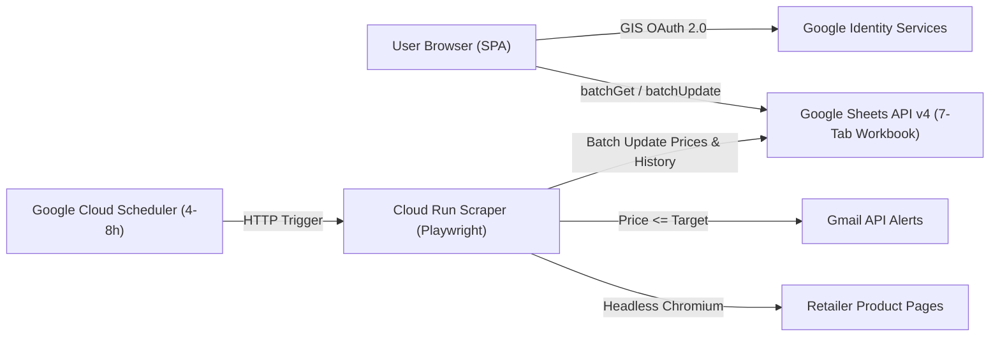
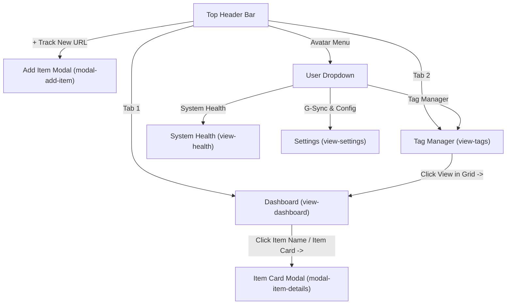

# Software Requirements Specification (SRS) — PricePulse

- **Document Version / App Target Baseline:** `0.3.6`
- **Status:** Active Implementation Baseline (`DS-BASELINE-360` Editorial Minimalism UI)
- **Primary Reference Prototype:** `ui_prototype.html` (v1.12) & `DS-BASELINE-360` (v1.0.0)
- **Data Model Reference:** `docs/GSHEETS_DATA_MODEL.md`
- **Architectural Decisions Reference:** `docs/PROJECT_DISCUSSION_AND_DECISIONS.md`

---

## 1. Purpose, Scope & Core Principles

### 1.1 Purpose
**PricePulse** is a personal, automated e-commerce price intelligence and deal-tracking application. It monitors arbitrary retailer product URLs, records historical price trajectories, alerts users when target prices are reached, and tracks realized savings when items are purchased.

### 1.2 Scope & Scale Target
- **Scale:** Optimized for **100–300 concurrent tracked URLs** (validated in prototype at 99 active positions + 12 archived bought items).
- **Infrastructure Budget:** Zero-cost personal deployment using **Google Sheets API v4** (database), **Google Cloud Run + Cloud Scheduler** (headless Playwright scraper), **Gmail API** (alerts), and a **Single-Page Application (SPA)** authenticated via **Google Identity Services (GIS) OAuth 2.0**.
- **Unified Tagging Principle:** The entire system uses a **1-level flat Tag model**. There are no separate "Categories", "Retailers", or "Taxonomy Types" anywhere in the data model, UI, filters, or grouping logic.

---

## 2. Application Architecture

### 2.1 Hexagonal Clean Architecture (`REQ-ARCH-01`)
Both the frontend SPA and backend scraper service MUST maintain strict separation across four layers:

1. **Domain Layer (`domain/`):** Pure entities, value objects, and business rules (`TrackedItem`, `BoughtItem`, `Tag`, `PriceSnapshot`, `TelemetryRun`, normalized `%` delta calculation, `saved_cost` calculation, `status` evaluation). Zero framework or I/O imports.
2. **Ports Layer (`ports/`):** Abstract interfaces defining external capabilities:
   - `ItemRepositoryPort` (read/write `Items`, `Bought_Items`, `Price_History`)
   - `TagRepositoryPort` (CRUD + rename/delete propagation on `Tags` and `Item_Tags`)
   - `ScraperPort` (fetch & extract price/title/image from arbitrary URL)
   - `NotificationPort` (dispatch target-price alerts)
   - `TelemetryPort` (record and query batch run logs)
3. **Adapters Layer (`adapters/`):** Concrete implementations:
   - **Google Sheets Adapter:** `spreadsheets.values.batchGet`, `batchUpdate`, `append`, and `DeleteDimensionRequest` over Google Sheets API v4.
   - **Playwright Waterfall Scraper Adapter:** Headless Chromium executing the 3-tier extraction heuristic (JSON-LD &rarr; OpenGraph/Meta &rarr; DOM/RegEx).
   - **Gmail API Adapter:** OAuth 2.0 consolidated digest sender.
   - **In-Memory / Local JSON Adapters (`REQ-ARCH-03`):** Deterministic local adapters implementing all repository, scraper, notification, and telemetry ports for offline development and Playwright E2E testing.
4. **Presentation Layer (`ui/` / `cli/`):** React 19 + TypeScript + Tailwind CSS SPA (plus FastAPI HTTP API & optional CLI runner for local batch diagnostics).

- **`REQ-ARCH-02` (Monorepo Layout):** The repository MUST be organized into `frontend/` (Vite + React 19 + TypeScript + Tailwind CSS SPA) and `backend/` (Python 3.12+ FastAPI + Playwright service, `src/pricepulse/`, `tests/`, `scripts/quality_check.py`).
- **`REQ-ARCH-03` (Offline Dev & E2E Parity):** Both `frontend/` and `backend/` MUST support deterministic In-Memory / Local JSON adapters via environment configuration so full workflows and Playwright E2E suites run offline without live Google credentials.

### 2.2 System Topology

```mermaid
flowchart LR
    User["User Browser (SPA)"] -->|"GIS OAuth 2.0"| Auth["Google Identity Services"]
    User -->|"batchGet / batchUpdate"| Sheets["Google Sheets API v4 (7-Tab Workbook)"]
    Cron["Google Cloud Scheduler (4-8h)"] -->|"HTTP Trigger"| Scraper["Cloud Run Scraper (Playwright)"]
    Scraper -->|"Headless Chromium"| Web["Retailer Product Pages"]
    Scraper -->|"Batch Update Prices & History"| Sheets
    Scraper -->|"Price <= Target"| Gmail["Gmail API Alerts"]
```

---

## 3. Data Architecture (Google Sheets Backend)

Full column-level schemas, formulas, and ER diagrams are defined in [docs/GSHEETS_DATA_MODEL.md](docs/GSHEETS_DATA_MODEL.md).

### 3.1 Workbook Entities (`REQ-DATA-01`..`REQ-DATA-06`)
- **`REQ-DATA-01` (7-Tab Workbook):** The datastore MUST consist of `Items`, `Bought_Items`, `Tags`, `Item_Tags`, `Price_History`, `Telemetry_Logs`, and `Config`.
- **`REQ-DATA-02` (1-Level Flat Tags & Junction):** `Tags` stores `{tag_id, name, color, created_at}` without any `type` or hierarchy field. `Item_Tags` resolves the many-to-many relation (`item_id`, `tag_id`) so tag renames are O(1) cell updates and deletions leave no orphaned strings.
- **`REQ-DATA-03` (Preserved `item_id` Across Lifecycle):** Moving an item from `Items` to `Bought_Items` (and restoring it via *Resume Tracking*) MUST preserve the exact `item_id` so `Price_History` and `Item_Tags` remain continuously linked.
- **`REQ-DATA-04` (Batch API & Sheet Formulas):**
  - Dashboard initialization MUST use a single `spreadsheets.values.batchGet` across active tabs.
  - `Items.status` (`ACTIVE` | `DISCOUNT`), `Items.drop_pct`, and `Bought_Items.saved_cost` (`MAX(0, initial_price - purchased_price)`) MUST be deterministically computable via Sheet formulas and mirrored in domain logic.
- **`REQ-DATA-05` (Sheet Schema Auto-Bootstrapping):** When connecting a new Google Spreadsheet ID, the system MUST inspect existing sheets and auto-initialize any missing tabs, canonical header rows, and formulas via `spreadsheets.batchUpdate`.
- **`REQ-DATA-06` (Multi-Currency Aggregation):** Monetary aggregations (`Total Saved Costs` KPI, Tag Manager `realized_savings`) MUST group and display totals per currency symbol (e.g., `$120.00 + ₴1,500` when mixed) without external FX API dependencies.

---

## 4. Application Structure & Navigation Map

### 4.1 Global Header & Navigation (`REQ-NAV-01`..`REQ-NAV-04`)
- **`REQ-NAV-01` (Compact Top Header):** Displays on `#FFFFFF` canvas with `1px solid #E5E7EB` bottom border:
  1. Brand lockup: `PricePulse` in `#09090B` (no redundant subtitle or tag-status badge).
  2. Primary navigation tabs (`whitespace-nowrap`, underlined `2px solid #09090B` active indicator on desktop): **Dashboard** (`view-dashboard`) and **Tag Manager** (`view-tags`), with **System Health** (`view-health`) and **G-Sync & Configuration** (`view-settings`) accessed via the User Avatar Dropdown.
  3. Global action buttons: single solid `#09090B` **+ Track New URL** primary CTA (the **Run Check** action lives inside the User Avatar Dropdown rather than the top bar).
  4. **User Avatar Menu** (`user-menu-btn` / `user-dropdown-menu`) showing `#F3F4F6` `PP` initials, name, and active sync status.
- **`REQ-NAV-02` (User Avatar Dropdown & Mobile Bottom Nav):** Clicking the avatar opens a light `#FFFFFF` menu containing:
  1. Sync summary (`N Positions & Tags Synced`)
  2. **System Health** (`Logs review` &rarr; `view-health`)
  3. **Tag Manager** (&rarr; `view-tags`)
  4. **G-Sync & Configuration** (`Sheet ID, Gmail alerts, schedule` &rarr; `view-settings`)
  5. **Run Check (`N` Items)** — Triggers an immediate batch price check across all active tracked items (`tabular-nums`).
  6. **Open Google Sheet** (external link to spreadsheet)
  7. **Sign out** (disconnect / switch account action)
  On mobile viewports (`< 768px`), a sticky 5-icon **Bottom Navigation Bar** (`#mobile-bottom-nav`) provides one-tap switching between `Dashboard`, `Tag Manager`, `Track New URL`, `System Health` (with `#EF4444` anomaly count badge), and `G-Sync Settings`, alongside the collapsible `#header__mobile-nav` drawer.
- **`REQ-NAV-03` (Single-View Switching):** Only one primary view (`view-dashboard`, `view-tags`, `view-health`, or `view-settings`) is visible at a time; switching tabs closes any open dropdowns and resets focus appropriately. Unauthenticated Sign In (`#auth-gate`) hides all app navigation chrome (`DS-LOGIC-03`) on a pure `#FFFFFF` canvas displaying `PricePulse`, `Sign in to your workspace`, a clean hairline divider, and a single `Continue with Google` OAuth button (`#F3F4F6` pill).
- **`REQ-NAV-04` (Modal / Bottom-Sheet Overlays):** `modal-add-item` and `modal-item-details` open over the active view as centered `#FFFFFF` dialogs on desktop and bottom sheets with a `36×4px` grab handle on mobile, with backdrop dismissal and explicit Close (`×`) controls.
- **`REQ-NAV-05` (Canonical URL Deep-Linking & History Parity):** Every view (`/dashboard`, `/tags`, `/health`, `/settings`), modal (`/items/:itemId`, `/items/new`, or `?modal=add`), and grid/chart filter (`?tab=active|bought&tag=<tag_id>`) MUST be synchronized with `window.location` via a centralized `src/shared/routes.ts` registry and History API (`pushState`/`replaceState`/`popstate`), respecting Vite's `BASE_URL` prefix (e.g. `/price-pulse/` on GitHub Pages). Dashboard-scoped query params (`?tab=`, `?tag=`) MUST be scoped strictly to `/dashboard` and cleared when switching between top-level sections. Direct cold loads, browser refresh, and Back/Forward navigation MUST restore the exact state; FastAPI MUST fall back non-`/api/*` routes to `frontend/dist/index.html` when built and GitHub Pages MUST publish `404.html` as a copy of `index.html`; missing/unknown item IDs MUST fall back cleanly to `/dashboard` with a `role="status"` notice.

```mermaid
flowchart TD
    Header["Top Header Bar"] -->|"Tab 1"| Dash["Dashboard (view-dashboard)"]
    Header -->|"Tab 2"| Tags["Tag Manager (view-tags)"]
    Header -->|"+ Track New URL"| AddModal["Add Item Modal (modal-add-item)"]
    Header -->|"Avatar Menu"| Menu["User Dropdown"]
    Menu -->|"System Health"| Health["System Health (view-health)"]
    Menu -->|"Tag Manager"| Tags
    Menu -->|"G-Sync & Config"| Settings["Settings (view-settings)"]
    Dash -->|"Click Item Name / Item Card ->"| DetailModal["Item Card Modal (modal-item-details)"]
    Tags -->|"Click View in Grid ->"| Dash
```

---

## 5. Functional Behavior & Controls Specification

### 5.1 Dashboard KPI Summary (`REQ-DASH-01`..`REQ-DASH-03`)
- **`REQ-DASH-01` (Active Monitoring Card):** Interactive `#FFFFFF` `<button>` card (`1px solid #E5E7EB`, zero drop shadow) displaying `12px` Medium `#09090B` label, `28px` Bold `#09090B` `tabular-nums` active item count (`state.items.length`), and `11px` `#71717A` subtitle `<tagCount> Tags • <itemCount> Tracked`. Clicking selects the `Active Positions` tab and smoothly scrolls to `#grid-panel`.
- **`REQ-DASH-02` (Total Saved Costs Card):** Interactive monochrome hairline `#FFFFFF` `<button>` card displaying sum of `saved_cost` across all `Bought_Items` in formatted `tabular-nums` currency (`#09090B`) and count of archived items. Clicking switches `#grid-panel` to the `Bought Items Sheet` tab (`?tab=bought`) and smoothly scrolls to `#grid-panel`.
- **`REQ-DASH-03` (Engine Health Card):** Interactive monochrome hairline `#FFFFFF` `<button>` card displaying current operational status (`tabular-nums`) and latest batch duration summary. Clicking navigates directly to `System Health` (`view-health` / `/health`).

### 5.2 Total Price Dynamic & Market Trajectory Chart (`REQ-CHART-01`..`REQ-CHART-06`)
- **`REQ-CHART-01` (Normalized % Y-Axis, Gridlines & Timestamp Timeline):** Plots canonical `%` delta recomputed against each item's `initial_price` (`0.0%` dashed baseline) with 5%-step `#F3F4F6` horizontal gridlines (`+5%` down to `-30%`+), distinct per-series stroke and point colors assigned deterministically from `SERIES_PALETTE` (with Cobalt Blue `#2563EB` primary area gradient, subtle per-series vertical line separation, two-pass 1D de-overlapped bullet markers in a dedicated top SVG layer, haloed endpoint dot, and hover/focus dimming of non-focused series), a top status bar (`0.0% Baseline`, `↓ Negative % = Price Drop`, `Visible: X of Y items`), timestamp-aligned X coordinates across `[minTs, maxTs]` (with a dashed lead-in indicator for single-snapshot items), and a deduplicated bottom X-axis timeline footer (no repeated `Yesterday` labels, ending with `Latest Check (Pooled)`), allowing items at vastly different price points to be compared on a single chart.
- **`REQ-CHART-02` (Series Visible Control Panel):** Positioned to the right of the SVG chart on desktop (`>= 1024px`) with a clean `1px solid #F3F4F6` divider and collapsed by default behind an adjacent `Series Filters (X/Y)` toggle bar directly above the panel on smaller/mobile viewports (`< 1024px`), containing in strict top-to-bottom order:
  1. Header + **Select All / Unselect All** toggle button.
  2. **Filter by Tag** (`chart-category-filter`) dropdown (`All Tags (N)` + all registered tags), placed **below Select All and above Search**.
  3. **Filter series...** `#F3F4F6` borderless text search input (matches item `name` or any assigned `tag`).
  4. Scrollable checkbox list of items with series-matched color dots from `SERIES_PALETTE` (`#D4D4D8` when unchecked), truncated title, current drop `%` (`tabular-nums`), and keyboard focus isolation (`onFocus`/`onBlur` highlights the focused series and dims others).
- **`REQ-CHART-03` (Presets):** Filled Pill Tabs **Top 5 Drops** and **All in View** (`#09090B` active vs `#F3F4F6` inactive).
- **`REQ-CHART-04` (Interactive Per-Bullet Tooltips):** Hovering or clicking any plotted bullet dynamically positions a floating tooltip near that specific bullet (without occluding it) displaying the item's series color dot, item name, assigned `Tags`, snapshot point index (`Point k/N`) and event type, exact price, recomputed `%` delta vs `initial_price` baseline, and formatted timestamp.
- **`REQ-CHART-05` (Bi-Directional Chart &harr; Grid Sync):** Selecting a tag in the Chart dropdown updates the Data Grid's active tag filter (`state.activeLabelFilter`), resets grid pagination to page 1, and re-renders the grid. Conversely, selecting a tag in the Data Grid's `Filter by Tag:` bar or clicking a tag chip updates the Chart dropdown and plotted series.

### 5.3 Data Grid & Bought Items Sheet (`REQ-GRID-01`..`REQ-GRID-08`)
- **`REQ-GRID-01` (View Switcher Tabs):** Filled Pill Tabs (`#09090B` active vs `#F3F4F6` inactive) toggling between **Active Positions (`N`)** and **Bought Items Sheet (`M`)**.
- **`REQ-GRID-02` (Grid Toolbar Controls):**
  - **Group By** dropdown: `Flat List (None)` or `Tag` (no Category or Retailer grouping).
  - **Search** `#F3F4F6` borderless input well: filters by item `name` or any assigned `tag` across both Active and Bought views. (New URL creation lives exclusively in the top header's `+ Track New URL` primary CTA and mobile bottom bar.)
- **`REQ-GRID-03` (Quick Tag Filter Bar):** Horizontal scrollable strip (`Filter by Tag:`) showing `Show All` plus one color-coded button (`TAG_BADGE_CLASSES[tag.color]` with `TAG_DOT_CLASSES[tag.color]` indicator dot when inactive, `#09090B` active ink when selected) per distinct tag present on active items.
- **`REQ-GRID-04` (Active Positions Table Columns):**
  1. `Product Name` (sortable; `44×44px` rounded thumbnail + clickable title button opening `modal-item-details`)
  2. `Tags` (semantic color-coded tag pills via `TAG_BADGE_CLASSES[tag.color]`)
  3. `Baseline` (`initial_price`, sortable, `tabular-nums`)
  4. `Current Price` (sortable, `tabular-nums`)
  5. `Target Alert` (`target_price`, sortable, `tabular-nums`)
  6. `Trend Dynamic` (inline Cobalt Blue `#2563EB` SVG sparkline)
  7. `Drop %` (sortable; `-X%` badge or `NORMAL`, `tabular-nums`)
  8. `Actions` (outlined `Item Card →` button)
- **`REQ-GRID-05` (Clickable Tag Chips in Grid):** Every tag chip rendered in the `Tags` column (in both Active Positions and Bought Items) MUST be an interactive `<button>` that filters the grid by that tag (and syncs the Chart); clicking the already-active tag chip clears the filter back to `ALL`.
- **`REQ-GRID-06` (Collapsible Group By Tag Mode):** When `Group By: Tag` is selected, items are partitioned under collapsible group header rows (`<TagName>`, item count, average drop `%`); pagination is hidden in grouped mode.
- **`REQ-GRID-07` (Pagination):** In `Flat List (None)` mode, paginate at **15 items per page** with `← Prev`, numbered page buttons, and `Next →` plus range indicator (`Showing X–Y of Z active positions`).
- **`REQ-GRID-08` (Bought Items Columns):** `Product Name` (clickable &rarr; Item Card in bought mode), `Tags` (clickable tag chips), `Baseline`, `Bought Price`, `Realized Savings` (`+$X.XX SAVED`), `Date Bought`, `Actions` (`View Card`).

### 5.4 Modals: Track New URL & Item Card (`REQ-MODAL-01`..`REQ-MODAL-06`)
- **`REQ-MODAL-01` (No Technical Selector Fields):** `modal-add-item` MUST NOT expose CSS/XPath selector inputs to end users.
- **`REQ-MODAL-02` (Add Item Flow):** User pastes URL into a `#F3F4F6` input well, clicks outlined **Fetch Preview** (auto-populates title, price, image, suggested tags), optionally selects one-tap workspace tag pills or edits **Tags (comma-separated)**, and clicks the single `#09090B` **Save & Start Tracking** CTA. Any unknown tags entered are auto-registered in `Tags`.
- **`REQ-MODAL-03` (Item Card Details & Price Chart):** `modal-item-details` displays product image, monochrome status/discount badge (`-X% DISCOUNT`, `ACTIVE`, or `BOUGHT`), clickable `Open Original Retailer Web Page ↗` link (rendered Unicode glyph, never raw `&nearr;`), Checkout-style 2-column asymmetric key-value rows (`TAGS`, `TITLE`, `PRICING` with `tabular-nums`), editable title, `Baseline Price`, `Current Tracked Price`, editable `Alert Target Price` (saved via single `#09090B` **Save Changes**, dismissed via muted **Close**), `Last checked` relative timestamp, and an interactive SVG `Price Dynamics` chart in Cobalt Blue (`#2563EB`) with `Value` readout, dashed `#71717A` `Target Threshold` reference line, and per-bullet hover tooltips (`Point k/N`, exact price, recomputed `%` delta vs baseline, timestamp).
- **`REQ-MODAL-04` (Inline Tag Management on Item Card):** Displays assigned tags as monochrome `#F3F4F6` removable chips (`×`) and an **+ Add Tag** input + outlined button (`Enter` or click) that attaches the tag (auto-registering if new) and syncs all views.
- **`REQ-MODAL-05` (Buy & Archive Workflow):** Active Item Cards provide a quiet `#F3F4F6` settlement well (`Bought this item? Move to Bought Items Sheet`) with an editable purchase price (defaulting to `current_price`) and outlined **Confirm Buy** button. Confirming moves the item to `Bought_Items`, freezes polling, records `saved_cost`, attaches `Purchased`, and switches to the `Bought Items Sheet` view. Bought Item Cards offer **Resume Tracking** to move the item back to `Items`.
- **`REQ-MODAL-06` (Delete Position Location):** **Delete Position** renders with a permanent soft-red destructive accent (`bg-red-50 text-red-600`) in its resting state (two-step solid-red **Confirm Delete** on click) and is located exclusively inside the `modal-item-details` footer (never on dashboard rows/titles), removing the position after confirmation.

### 5.5 Tag Manager (`view-tags`) (`REQ-TAG-01`..`REQ-TAG-04`)
- **`REQ-TAG-01` (Single-Level Creation Form):** Single `#09090B` `+ Create New Tag` button reveals a minimal form containing **Tag Name** and **Color Theme** (`purple`, `amber`, `emerald`, `blue`, `rose`, `cyan`, `slate` rendered with `TAG_BADGE_CLASSES`), plus a Save button.
- **`REQ-TAG-02` (2-Column Tag Data Grid):** Displays tags in a clean `#FFFFFF` hairline table/list:
  - **Column 1 (`Tag Name`):** Color-tinted pill badge (`TAG_BADGE_CLASSES[tag.color]`) with `6px` `TAG_DOT_CLASSES[tag.color]` indicator dot.
  - **Column 2 (`Additional Info & Edit Options`):** Active item count, average drop `%`, realized savings from `Bought_Items` formatted with workspace currency (`tabular-nums`), inline **Color Theme** `<select>` styled with `TAG_BADGE_CLASSES[tag.color]`, outlined **View in Grid &rarr;** (switches to Dashboard filtered to that tag), **Rename**, and hover-red **Delete**.
- **`REQ-TAG-03` (Search & Summary):** Live `#F3F4F6` tag search input and total active tags counter.
- **`REQ-TAG-04` (Cascading Rename & Delete):** Renaming or deleting a tag updates `Tags`, `Item_Tags`, active `Items`, `Bought_Items`, Chart filter options, and the Dashboard quick-filter bar atomically.

### 5.6 System Health (`view-health`) & Settings (`view-settings`) (`REQ-HEALTH-01`, `REQ-CFG-01`)
- **`REQ-HEALTH-01` (Telemetry Table & Manual Run):** Displays 6-cell `RULE-DIAG` runtime context card (`App Version`, `Python Executable`, `Storage Adapter`, `Python Runtime`, `Platform`, `Active Workspace`) and telemetry ledger (`Run ID`, `Timestamp`, `Status`, `Checked`, `Breakdown`, `Duration`, and JSON log inspection) where `SUCCESS` runs use neutral `#F3F4F6` pills and `PARTIAL`/`ERROR` anomalies display a Crimson Red (`#EF4444`) `6px` dot. **Run Batch Check Now** (`#09090B`) triggers an immediate pooled batch check.
- **`REQ-CFG-01` (G-Sync & Configuration):** Checkout-style 2-column asymmetric key-value ledger (`WORKBOOK ID`, `ALERT EMAIL`, `POLLING CADENCE` with interactive Filled Pill Tabs + accessible `<select>`), outlined **Initialize 7-Tab Schema**, and single `#09090B` **Save Configuration** CTA.

### 5.7 Backend Extraction, Auth & Alerting (`REQ-SCRAPE-01`..`REQ-AUTH-02`)
- **`REQ-SCRAPE-01` (3-Tier Waterfall Extraction):** Scraper executes Tier 1 (`application/ld+json` `schema.org/Product`/`Offer`, including `ImageObject` dict `url` normalization), Tier 2 (OpenGraph/Meta + Schema.org `itemprop="price"`/`priceCurrency` tags), and Tier 3 (visible-text DOM prefix/suffix currency RegEx including `UAH`/`грн` after stripping `<script>`, `<style>`, `<noscript>`, `<template>` + `html.unescape` title normalization) inside headless Playwright.
- **`REQ-SCRAPE-02` (Pooled Concurrency, HTTP Guard & Revolving Proxy Fallback):** Batch scraping MUST reuse a single shared Chromium browser instance (launched with container-safe `--disable-dev-shm-usage` and `--disable-blink-features=AutomationControlled` flags and `Accept-Language` headers) with `asyncio.Semaphore(4)`, a 20s per-URL timeout, an `HTTP >= 400` status guard (raising `ValueError` instead of extracting prices from WAF/error pages), 1 retry on transient failure, and optional `SCRAPER_PROXY_URL` revolving proxy pool (`parse_proxy_pool` supporting comma/newline-separated `host:port:user:pass` and URL formats; direct-first fetch with round-robin fallback across up to 10 proxies), recording `PARTIAL` status in `Telemetry_Logs` when individual URLs fail without aborting the batch.
- **`REQ-ALERT-01` (Consolidated Gmail Digest):** When `current_price <= target_price` and an item either transitions `ACTIVE` &rarr; `DISCOUNT` or reaches a new `lowest_price` while discounted, dispatch a single consolidated digest email per batch run to the configured recipient via Gmail API.
- **`REQ-AUTH-01` (SPA-to-Backend Auth & Same-Origin Routing):** Production SPA builds default to same-origin `/api/...` paths (`DEV` falls back to `127.0.0.1:8000`) or `VITE_API_BASE_URL` (for GitHub Pages → Cloud Run). When `VITE_GOOGLE_CLIENT_ID` is configured, the SPA renders an accessible Google Identity Services Sign-In gate (`auth-gate`) and sends the Bearer token to FastAPI; the backend (`AUTH_MODE=google_oauth`) verifies the token via `tokeninfo`, enforces `GOOGLE_CLIENT_ID` (`aud`/`azp`) matching so any Google Console Test User can authenticate (with optional `ALLOWED_OWNER_EMAIL` allowlist), and supports `AUTH_MODE=local_dev` bypass on `127.0.0.1`.
- **`REQ-AUTH-02` (Unattended Cron Auth & Cloud Deployment):** Cloud Run (`europe-central2`, `1Gi` RAM, `Dockerfile` with `libatomic1` + Chromium) scheduled batch runs (`0 9 * * *` `Europe/Kyiv`) authenticate to Google Sheets API v4 and Gmail API using a Secret Manager OAuth 2.0 Refresh Token (without hardcoded cross-service scopes on `Credentials`) and optionally consume `SCRAPER_PROXY_URL` from Secret Manager (`pricepulse-scraper-proxy:latest`). `POST /api/cron/run-check` MUST enforce `X-Cron-Secret` (`hmac.compare_digest`) when `CRON_SECRET` is configured, paired with Cloud Scheduler OIDC IAM invocation.

---

## 6. Non-Functional, Accessibility & Quality Governance

- **`REQ-A11Y-01` (Semantic HTML & WAI-ARIA):** All clickable actions (including grid tag chips, item titles, group headers, and modal triggers) MUST use `<button>`, modals MUST use `<dialog>` or `role="dialog"`, icon-only buttons MUST have `aria-label`, and dynamic filter/toggle states MUST expose `aria-pressed` / `aria-expanded`.
- **`REQ-A11Y-02` (BEM Anchor Registry):** All structural landmark, panel, form, and modal IDs MUST follow `block__element` kebab-case without `--modifier` suffixes in `id`, registered in a single `src/shared/anchors.ts` source of truth.
- **`REQ-QA-01` (Automated Verification):** Frontend MUST enforce `eslint-plugin-jsx-a11y` in `strict` mode and Playwright E2E tests using A11y-tree queries (`getByRole`, `getByLabel`, `getByText`). Backend/Python modules MUST maintain 100% type annotations, PEP-8 (`<=100` chars), and 100% passing unit tests.
- **`REQ-DIAG-01` (Diagnostic Observability):** Backend/CLI and System Health views MUST expose runtime context (`sys.executable`, `sys.version`, `sys.platform`, dependency versions, workspace path), timestamped `INFO`/`WARN`/`ERROR` logs (including stdout batch error summaries for Cloud Run), and full stack traces on failure (including a global FastAPI unhandled-exception JSON handler).
- **`REQ-NFR-01` (Mobile-First Responsive Layout):** Zero horizontal page overflow across mobile (`320px+`) and desktop viewports. Data grids (`PositionsGrid`, `TagManagerView`, `SystemHealthView`) MUST render stacked touch-friendly cards on `< 768px` (`md:hidden`) and full tables on `>= 768px`; on `< 768px`, the top navigation bar collapses into an accessible hamburger toggle button (`header__mobile-nav`) paired with a sticky 5-icon bottom navigation bar (`mobile-bottom-nav`); modal forms render as mobile bottom sheets (`36×4px` grab handle) and stack cleanly on narrow screens; long product names truncate gracefully with `title` tooltips. On mobile (`< 768px`), the Dashboard KPI summary tiles (`Active Monitoring`, `Total Saved Costs`, `Engine Health`) MUST appear below `PositionsGrid` (`order-3 md:order-1`) so primary content appears near the fold. All enabled clickable controls (`button`, `a[href]`, `select`, `role="tab"`, `role="menuitem"`, checkboxes) MUST expose `cursor: pointer`.

---

## 7. Revision History

| Version | Date | Author | Summary of Changes |
| :--- | :--- | :--- | :--- |
| `0.1.0` | 2026-11-13 | Antigravity | Initial SRS baseline synthesized from validated `ui_prototype.html` (v1.12), `PROJECT_DISCUSSION_AND_DECISIONS.md`, and `GSHEETS_DATA_MODEL.md`. |
| `0.2.0` | 2026-11-13 | Antigravity | Added `REQ-ARCH-02..03` (monorepo `frontend/` + `backend/`, offline dev/E2E adapters), `REQ-DATA-05..06` (auto-bootstrapping, multi-currency grouping), `REQ-SCRAPE-02` (pooled Semaphore(4) & retries), consolidated digest `REQ-ALERT-01`, and `REQ-AUTH-01..02`. |
| `0.2.1` | 2026-11-14 | Antigravity | Refined `REQ-NAV-05` (`src/shared/routes.ts` URL deep-linking with `BASE_URL` subpath support, FastAPI SPA fallback, GitHub Pages `404.html`), `REQ-CHART-01..02` (5%-step gridlines, timestamp-aligned X-axis, single-snapshot lead-in, focus isolation, mobile `Series Filters` toggle), `REQ-MODAL-03..06` (Price Dynamics + Target Threshold chart, `Confirm Buy`, `Save Changes`, `Delete Position`), `REQ-NFR-01` (mobile cards `< 768px`, collapsible hamburger nav `header__mobile-nav`, `320px+` bounding-box audit, mobile KPI tiles below `PositionsGrid`, global `cursor: pointer`), `REQ-SCRAPE-01..02` (`itemprop` microdata, suffix `UAH`/`грн`, `html.unescape`, container Chromium flags), `REQ-AUTH-01..02` (GIS Sign-In gate, `aud`/`azp` Console Test-User verification, `X-Cron-Secret`, Cloud Run `europe-central2` + Cloud Scheduler), `REQ-DIAG-01` (unhandled 500 JSON traceback + stdout errors), and `verify_live_setup.py`. |
| `0.2.2` | 2026-11-15 | Antigravity | Refined `REQ-SCRAPE-01..02` (`ImageObject` dict `url` extraction, `<script>`/`<style>`/`<noscript>`/`<template>` stripping prior to Tier 3 RegEx, `HTTP >= 400` status guard, and `SCRAPER_PROXY_URL` revolving proxy pool with direct-first fetch and 10-proxy round-robin fallback) and `REQ-AUTH-02` (daily `0 9 * * *` `Europe/Kyiv` Cloud Scheduler cadence + Secret Manager `pricepulse-scraper-proxy`). |
| `0.3.0` | 2026-11-15 | Antigravity | Full `DS-BASELINE-360` High-Contrast Editorial Minimalism UI redesign across all 7 screens: 90/8/2 light surface ratio (`#FFFFFF` / `#F3F4F6` / `#09090B`), Single Ink Anchor (`#09090B`) CTA discipline, Cobalt Blue (`#2563EB`) focus trajectory & micro-sparklines, Crimson Red (`#EF4444`) anomaly dots, unified monochrome tag badges, Checkout-style 2-column asymmetric key-value forms, deduplicated chart X-axis labels, fixed `↗` retailer link glyph, workspace-currency `tabular-nums` alignment, chromeless Auth Gate, mobile bottom sheets, and 5-icon `mobile-bottom-nav`. |
| `0.3.1` | 2026-11-15 | Antigravity | Made Dashboard KPI tiles interactive (`REQ-DASH-01..03`: `Active Monitoring` scrolls to `#grid-panel`, `Total Saved Costs` switches to `Bought Items Sheet` and scrolls to `#grid-panel`, `Engine Health` navigates to `/health`), simplified top header desktop navigation (`REQ-NAV-01`) to 2 tabs (**Dashboard**, **Tag Manager**; leaving **System Health** and **G-Sync & Configuration** in the `PP Owner` dropdown), and streamlined `#auth-gate` Sign-In screen (`REQ-NAV-03`) to remove email input / `Continue` form and `"or"` divider, keeping `PricePulse`, `Sign in to your workspace`, hairline divider, and `Continue with Google` CTA. |
| `0.3.2` | 2026-11-15 | Antigravity | Restored distinct per-series colors (`SERIES_PALETTE`) across the `TrajectoryChart` SVG lines, point markers, endpoint halo, and `Series Visible` legend dots with keyboard focus isolation (`REQ-CHART-01..02`). |
| `0.3.3` | 2026-11-15 | Antigravity | Restored semantic `Tag.color` pill and color-select styling (`TAG_BADGE_CLASSES`, `TAG_DOT_CLASSES`) across `PositionsGrid` (`Filter by Tag:` and `Tags` column), `TagManagerView` (`Tag Name` pill + `Color Theme` `<select>`), and modals (`REQ-GRID-03..04`, `REQ-TAG-01..02`), and removed duplicate `+ Add URL` button from `PositionsGrid` toolbar (`REQ-GRID-02`). |
| `0.3.4` | 2026-11-15 | Antigravity | Applied permanent resting soft-red destructive accent (`bg-red-50 text-red-600`) to **Delete Position** in the `ItemDetailsModal` footer (`REQ-MODAL-06`). |
| `0.3.5` | 2026-11-15 | Antigravity | Recomputed canonical `delta_pct` from `initial_price` in `GoogleSheetsRepository.load_state()`, de-overlapped coincident pooled-check bullets in a dedicated top SVG layer with dynamic per-bullet tooltips in `TrajectoryChart` (`REQ-CHART-01`, `REQ-CHART-04`), added per-bullet hover tooltips to `ItemDetailsModal` (`REQ-MODAL-03`), and fixed `Series Visible` focus-dimming reset. |
| `0.3.6` | 2026-11-15 | Antigravity | Moved `Run Check (N Items)` button from top header bar into `#user-dropdown-menu` below `G-Sync & Configuration` (`REQ-NAV-01..02`). |
